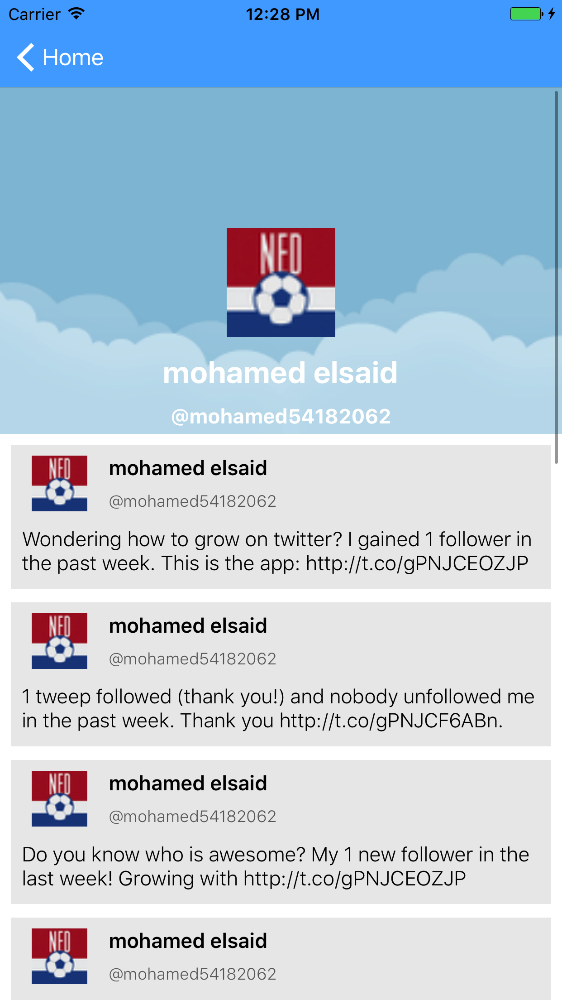

# Twitter-Client

A Simple iOS Twitter Client 

- Login with twitter 
- Save Account on Device Settings
- Handle Login For One Time Only
- Followers list with autoresized cells 
- Offline caching for followers list
- Grid view for landscape orientation
- Follower profile with the latest 10 tweets
- Sticky header for profile user info. 
- Clickable profile and background images 
- Localization (Arabic/English)


Home .                     |  Profile
:-------------------------:|:-------------------------:
  |  

# Build Application
- clone the repository 
- open the terminal inside the project folder
- run this command
```terminal
pod install
```

# Libraries Used
- [TwitterKit](https://dev.twitter.com/twitterkit/ios/installation)
- [SwiftyJSONs](https://github.com/SwiftyJSON/SwiftyJSON)
- [SDWebImage](https://github.com/rs/SDWebImage)
- [ImageViewer](https://github.com/MailOnline/ImageViewer)
- [CSStickyHeaderFlowLayout](https://github.com/CSStickyHeaderFlowLayout/CSStickyHeaderFlowLayout)
